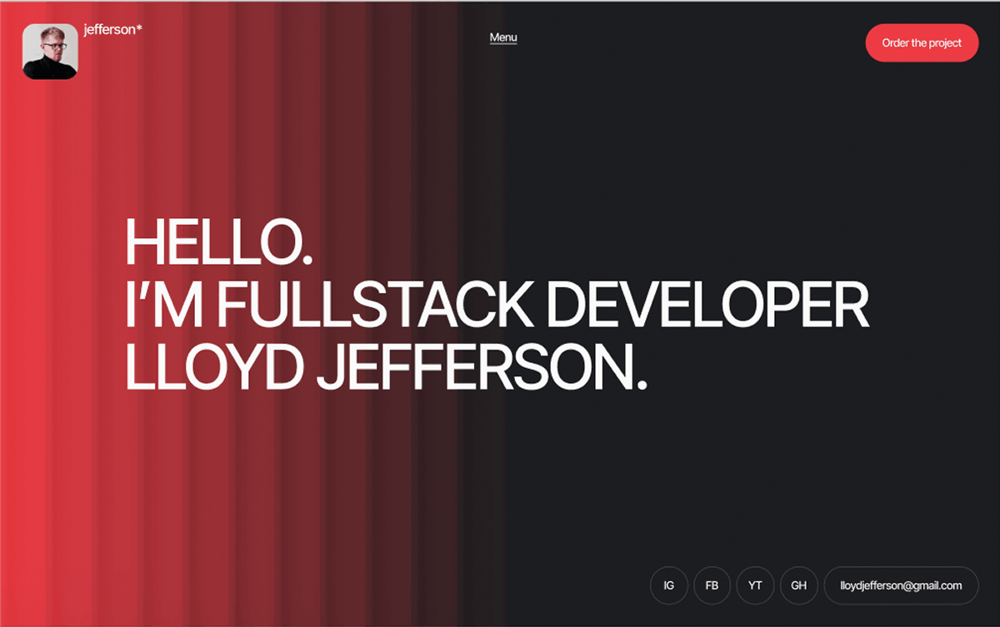

# 🚀 Lloyd Jefferson --- Fullstack Developer Portfolio

💻 **Сучасне портфоліо розробника** з акцентом на стиль, UX та презентацію
проєктів\
✨ Демонструє навички, досвід та реальні роботи в зручному форматі

🔗 **Демо:** https://constantinekobushka.github.io/lloyd-jefferson/



---

## 🧑‍💻 Про проєкт

**Lloyd Jefferson Portfolio** --- це односторінковий сайт (_portfolio landing
page_), створений для ефективної презентації розробника як спеціаліста.

Сайт дозволяє:

- показати свої **проєкти**
- презентувати **навички**
- описати **досвід і освіту**
- отримувати **запити на співпрацю**

📌 Основна мета --- створити **враження професійного та сучасного розробника**,
який вміє не тільки писати код, але й робити гарний UI.

---

## 🧩 Структура сайту

- 🔝 Header\
- 🧑‍💻 Hero\
- 📖 About Me\
- ⚡ Benefits\
- 💼 Projects\
- ❓ FAQ\
- 🖼️ Covers\
- 💬 Reviews\
- 🤝 Work Together

---

## 🌟 Основний функціонал

- 📌 Якірна навігація з плавним скролом
- 📱 Адаптивне меню (burger menu)
- 🎞️ Слайдери (Swiper.js)
- 📂 Accordion (About / FAQ)
- 🌐 Робота з API
- 📨 Форма з валідацією
- 🔔 Модальне вікно
- ⚠️ Обробка помилок

---

## 🎨 Дизайн та UX

- 🌙 Темна тема
- 🔵 Градієнти
- 🧊 Card UI
- ✨ Hover-ефекти
- 🖼️ Якісні зображення

---

## 🧰 Технологічний стек

- HTML5\
- CSS3 / SCSS\
- JavaScript (ES6+)\
- Swiper.js\
- Vite

---

## 📡 API

https://portfolio-js.b.goit.study/api-docs

---

## 📱 Адаптивність

- Mobile: 320px → 375px\
- Tablet: 768px\
- Desktop: 1440px

---

## 🚀 Запуск

```bash
git clone https://github.com/ConstantineKobushka/lloyd-jefferson
cd portfolio
npm install
npm run dev
```
